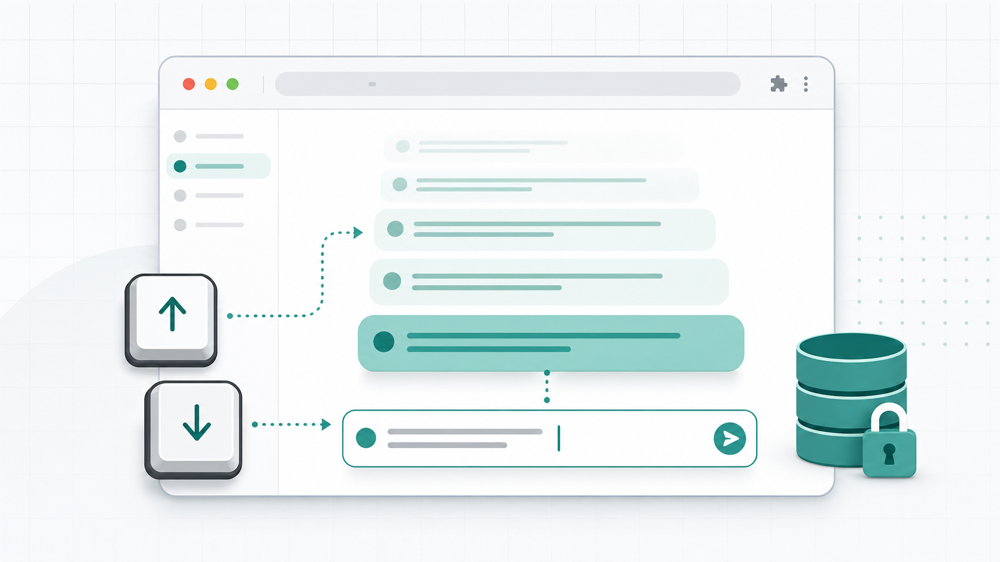

# gpt-history


A Chrome extension that lets you recall messages from the currently open ChatGPT conversation with the `↑` / `↓` arrow keys, similar to shell history in bash or zsh.



## Features

- Press `↑` to recall the previous message and `↓` to move forward again.
- Works even when you open an existing conversation midway: visible user messages are picked up from the page immediately.
- Only the currently open chat is used. When you switch chats, the previous chat's candidates are cleared.
- Multi-line editing still works. `↑` is intercepted only on the first line, and `↓` only on the last line.
- No persistent history storage. The extension uses visible messages from the open chat plus a short-lived in-memory buffer for messages that have just been sent but not yet rendered.
- Empty messages and consecutive duplicates are ignored.

## Usage

| Key | Action | Trigger condition |
|---|---|---|
| `↑` | Recall the previous message | Input is empty, or the caret is on the first line |
| `↓` | Recall the next message | Input is empty, or the caret is on the last line |
| `↑` / `↓` | Normal cursor movement | The caret is between the first and last lines |

If you had a draft before starting history navigation, it is preserved. Press `↓` past the newest history entry to restore that draft.

## Installation

### Load from GitHub

1. Clone this repository or download it as a zip.
2. Install dependencies and build the extension.

   ```bash
   pnpm install
   pnpm build
   ```

3. Open `chrome://extensions/` in Chrome.
4. Turn on **Developer mode**.
5. Click **Load unpacked** and select the `dist/` directory.
6. Open `https://chatgpt.com`; the extension is now active.

### Chrome Web Store

Not published yet.

## Privacy

**History is not persisted and is never transmitted externally.**

The extension reads visible user messages from the currently open ChatGPT page and keeps only in-memory state for navigation. It does not use analytics, external APIs, cloud sync, `chrome.storage.local`, or `chrome.storage.sync`. See [PRIVACY_POLICY.md](./PRIVACY_POLICY.md) for details.

## Known Limitations

- If ChatGPT changes its DOM, the extension may fail to find the input box, send button, or visible user messages.
- Arrow keys and Enter are not intercepted while an IME composition is active.
- Only `chatgpt.com` is supported. Claude, Gemini, and other sites are out of scope.

## Development

```bash
pnpm install
pnpm dev        # development build
pnpm build      # production build into dist/
pnpm typecheck  # TypeScript type check
pnpm lint       # Biome lint
pnpm check      # Biome check
```

### Project Layout

```text
gpt-history/
├── manifest.json
├── src/
│   ├── content.ts     # content script entry point
│   ├── history.ts     # history navigation state
│   ├── caret.ts       # first-/last-line detection
│   ├── dom.ts         # input, send button, and visible message lookup
│   ├── keybind.ts     # keyboard event handling
│   └── constants.ts   # selectors and constants
├── docs/
│   └── screenshots/
└── icons/
```

## Contributing

Issues and pull requests are welcome. See [CONTRIBUTING.md](./CONTRIBUTING.md) for the project guidelines.

## License

[MIT License](./LICENSE)
